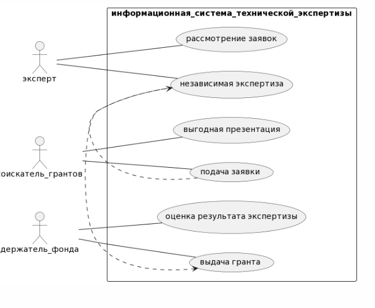
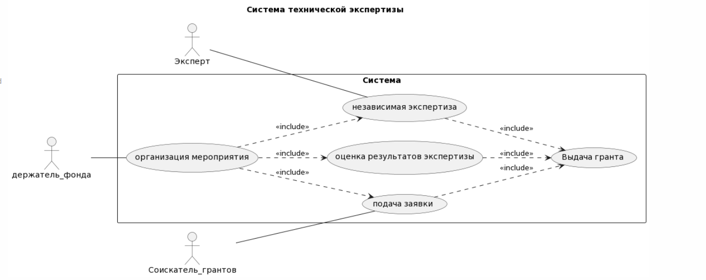
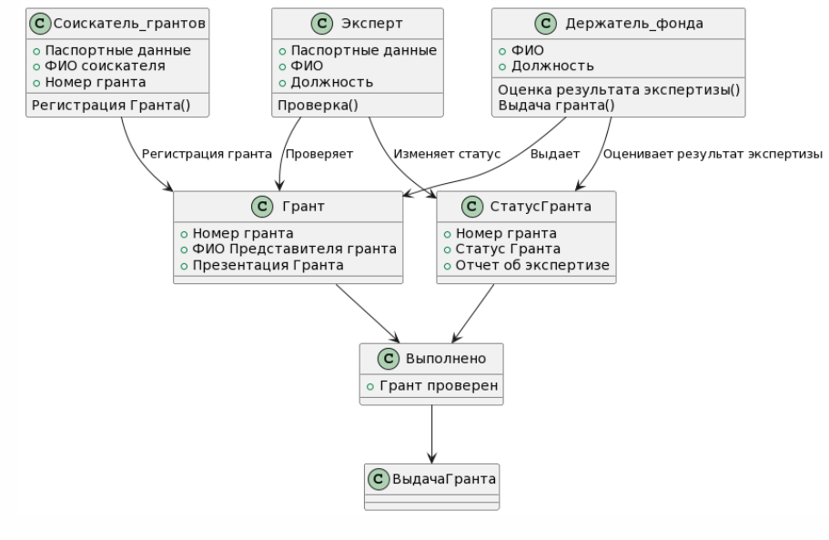
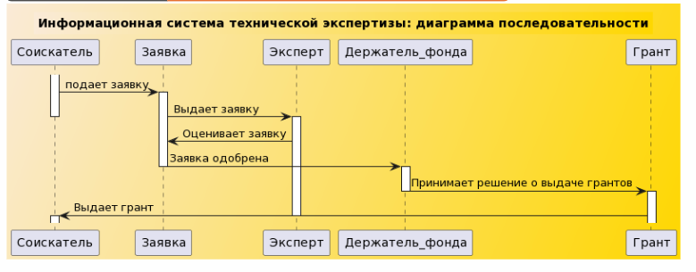
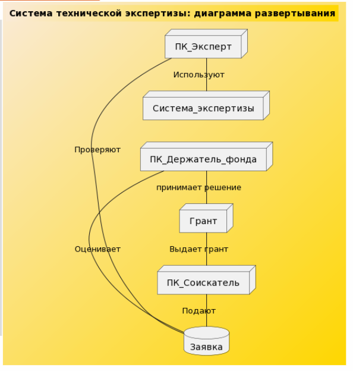

# Практика 0
```
@startuml
left to right direction
skinparam packageStyle rect

actor эксперт
actor соискатель_грантов
actor держатель_фонда

rectangle информационная_система_технической_экспертизы {
  
  соискатель_грантов--(подача заявки)
  соискатель_грантов--(выгодная презентация)

  (подача заявки) .> (независимая экспертиза)

  эксперт--(рассмотрение заявок)
  эксперт--(независимая экспертиза)
  
  (независимая экспертиза).> (выдача гранта)

  держатель_фонда--(оценка результата экспертизы)
  держатель_фонда--(выдача гранта)

}
@enduml

```



# Практика 1

```
@startuml
left to right direction
title Система технической экспертизы
actor Эксперт
actor Соискатель_грантов
actor держатель_фонда
rectangle Система {
держатель_фонда -- (организация мероприятия)
(организация мероприятия) ..>(подача заявки):<<include>>
(организация мероприятия) ..> (независимая экспертиза):<<include>>
(организация мероприятия) ..> (оценка результатов экспертизы):<<include>>

Соискатель_грантов -- (подача заявки)
(подача заявки) ..> (Выдача гранта):<<include>>
(независимая экспертиза) ..> (Выдача гранта):<<include>>
(оценка результатов экспертизы) ..> (Выдача гранта):<<include>>
Эксперт -- (независимая экспертиза)
}
@enduml

```

```

@startuml
class Эксперт{
+Паспортные данные
+ФИО
+Должность
Проверка()

}

class Соискатель_грантов{
+Паспортные данные
+ФИО соискателя
+Номер гранта
Регистрация Гранта()
}

class Грант{
+Номер гранта
+ФИО Представителя гранта
+Презентация Гранта
}

class Держатель_фонда{
+ФИО
+Должность
Оценка результата экспертизы()
Выдача гранта()
}

class СтатусГранта{
+Номер гранта
+Статус Гранта
+Отчет об экспертизе
}

class Выполнено{
+Грант проверен
}

Эксперт --> Грант:Проверяет
Соискатель_грантов --> Грант:Регистрация гранта
Держатель_фонда --> Грант:Выдает
Эксперт --> СтатусГранта:Изменяет статус
Держатель_фонда --> СтатусГранта:Оценивает результат экспертизы
СтатусГранта --> Выполнено
Грант --> Выполнено
Выполнено --> ВыдачаГранта

```



# Практика 2

```
@startuml
title Информационная система технической экспертизы: диаграмма последовательности
skinparam backgroundcolor AntiqueWhite/Gold
participant Соискатель
participant Заявка
participant Эксперт 
participant Держатель_фонда
participant Грант
activate Соискатель
Соискатель -> Заявка: подает заявку
activate Заявка
Заявка -> Эксперт : Выдает заявку
deactivate Соискатель
activate Эксперт 
Эксперт -> Заявка:Оценивает заявку
Заявка-> Держатель_фонда:Заявка одобрена
deactivate Заявка
activate Держатель_фонда
Держатель_фонда -> Грант:Принимает решение о выдаче грантов
deactivate Держатель_фонда
activate Грант
Грант-> Соискатель:Выдает грант
deactivate Эксперт 
activate Соискатель
@enduml 


```

```
@startuml
left to right direction
title Система технической экспертизы: диаграмма развертывания
skinparam backgroundcolor AntiqueWhite/Gold
database Заявка
node ПК_Эксперт
node ПК_Соискатель
node ПК_Держатель_фонда
node Грант
node Система_экспертизы

ПК_Эксперт - Заявка: Проверяют
ПК_Соискатель - Заявка: Подают
ПК_Эксперт - Система_экспертизы: Используют
ПК_Держатель_фонда - Заявка: Оценивает
ПК_Держатель_фонда - Грант: принимает решение
Грант - ПК_Соискатель: Выдает грант
@enduml

```


# Практика 3
```
@startuml
title Пратическая работа 3: Strategy
class Variant{
selection()
}
class Game{
strategy: Variant
init()
play()
}

class Paper{
selection()
}
class Rock{
selection()
}
class Scissors{
selection()
}
class Pencil{
selection()
}
class Fire{
selection()
}
class main{
int n
str vibor
playtime()
player1.play(player2)
}
note right of main::"playtime()"
player1 = playtime(vibor)
player2 = playtime(vibor)
end note

Paper --> Variant
Rock --> Variant
Scissors --> Variant
Pencil --> Variant
Fire --> Variant
main *--> Variant
main --Game
@enduml
```


```
@startuml
title Пратическая работа 3: Template Method
class Algorithm{
template_method()
flagstock()
draw_1()
draw_2()
draw_3()
final()
printer()
}
note right of Algorithm::"template_method()"
self.flagstock()
self.draw_1()
self.draw_2()
self.draw_3()
self.final()
self.printer()
end note

class colors{
painwhite()
painred()
painblue()
}

class RussianFlag{
z = colors
z.pain
draw_1()
draw_2()
draw_3()
final()
}
class  Austria{
z = colors
z.pain
draw_1()
draw_2()
draw_3()
}

Algorithm <|-- Austria :Немецкий флаг
Algorithm <|-- RussianFlag : Российский флаг

RussianFlag -  Austria
(RussianFlag, Austria) - colors:Задает цвет
@enduml
```


# Практика 4
```
@startuml
interface Iterator.Iterator {
+ boolean hasNext()
+ Object next()
}
interface Iterator.Aggregate {
+ Create Iterator()
+ Iterator()
}
class Iterator.Concrete_Iterator {
+ {static} void hasNext():Next
}
class Iterator.Concrete_Aggregate {
+ {static} void Create Iterator():Iterator
}

Iterator.Iterator <|..|> Iterator.Aggregate
Iterator.Aggregate ..> Iterator.Concrete_Iterator
Iterator.Concrete_Iterator ..> Iterator.Iterator
Iterator.Concrete_Aggregate ..> Iterator.Aggregate
@enduml
```


```
@startuml
interface Visitor.Studying_In_Institute {
+ void accept()
+ void teaching()
+ void studying()
}
class Visitor.Instructor {
+ void visit()
+ void teaching()

}
class Visitor.Student {
+ void visit()
+ void studying()
}
class Visitor.SDE {
+ void create(ProjectClass)
+ void create(DataBase)
+ void create(Test)
}
class Visitor.STL {
+ void beWritten(Developer)
}
class Visitor.DSA {
+ {static} void main(String[])
}

Visitor.DSA <|.. Visitor.Student
Visitor.DSA <|.. Visitor.Instructor
Visitor.SDE <|.. Visitor.Student
Visitor.SDE <|.. Visitor.Instructor
Visitor.STL <|.. Visitor.Student
Visitor.STL <|.. Visitor.Instructor
Visitor.Studying_In_Institute <|.. Visitor.Instructor
Visitor.Studying_In_Institute <|.. Visitor.Student
@enduml
```

